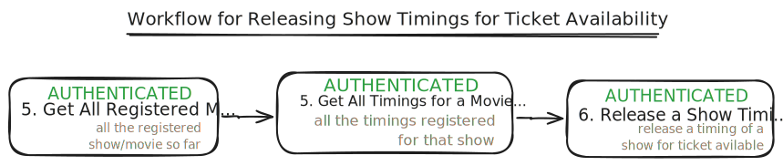

# Movie Ticketing API

## Overview
This movie ticketing API was developed during my internship as a comprehensive backend solution for cinema ticket booking operations. It provides a robust foundation for managing movie screenings, user bookings, and ticket transactions.

## WORKFLOW

    

 

    

 
 

    

 
 

    

 
 
## DATABASE SCHEMA

    

